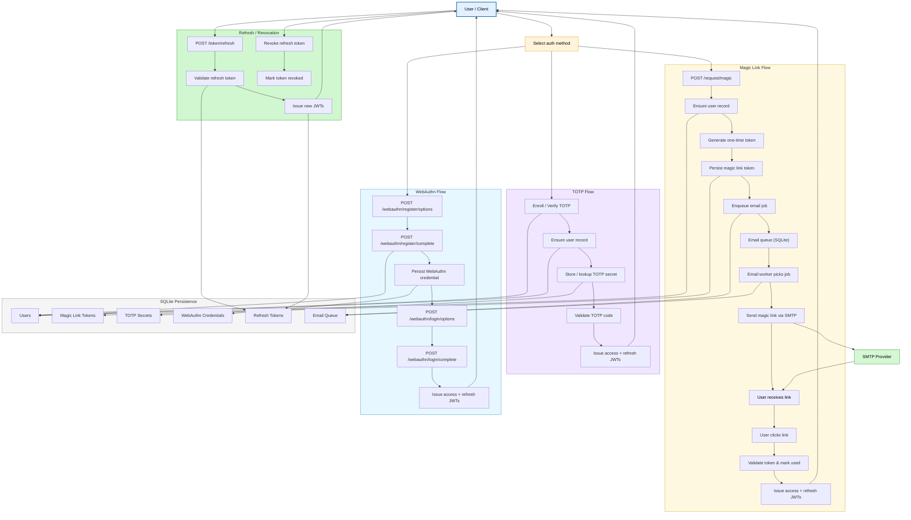
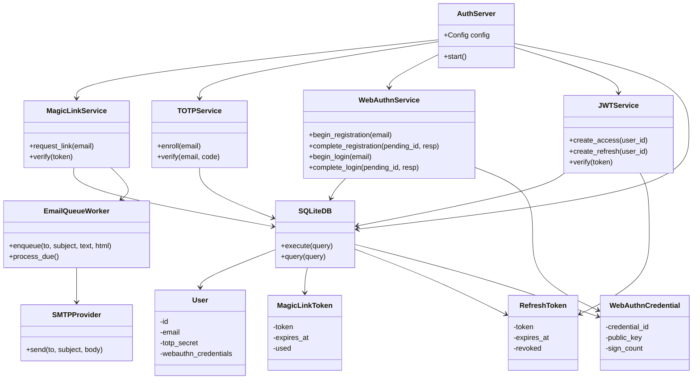

# Passwordless Auth — Self-Hosted Passwordless Authentication Server

<p>


</p>

## Table of Contents

1. [Overview](#overview)  
2. [Goals & Motivation](#goals--motivation)  
3. [Key Concepts](#key-concepts)  
   - [Core Technologies](#core-technologies)  
   - [Authentication Flows](#authentication-flows)  
   - [Security Primitives](#security-primitives)  
4. [Architecture Diagrams](#architecture-diagrams)  
   - [High-level architecture overview](#high-level-architecture-overview)  
   - [Class diagram for core components](#class-diagram-for-core-components)
5. [Quickstart](#quickstart)  
6. [Installation & Build](#installation--build)  
7. [Configuration](#configuration)  
8. [HTTP API Reference & Usage](#http-api-reference--usage)  
   - [Magic Link Flow](#magic-link-flow)  
   - [TOTP Flow](#totp-flow)  
   - [WebAuthn Flow](#webauthn-flow)  
   - [Token Refresh](#token-refresh)  
9. [OpenAPI Specification & Client Example](#openapi-specification--client-example)  
10. [Email Queue Worker](#email-queue-worker)  
11. [Testing](#testing)  
12. [Docker & Orchestration](#docker--orchestration)  
13. [Shell Helpers & Scripts](#shell-helpers--scripts)  
14. [Example File Layout After Run](#example-file-layout-after-run)  
15. [Troubleshooting & Common Issues](#troubleshooting--common-issues)  
16. [Security Considerations](#security-considerations)  
17. [Extension Points / Developer Notes](#extension-points--developer-notes)  
18. [Contributing](#contributing)  
19. [Glossary](#glossary)  
20. [License](#license)

## Overview

**Passwordless Auth** is a self-hosted identity and authentication server designed for small teams and internal tools. It provides modern passwordless login mechanisms—magic links delivered via email, WebAuthn (passkeys), and TOTP fallback—while issuing JWTs for session management. No third-party identity provider is required; all state is under your control, with revocable short-lived sessions and refresh tokens.

## Goals & Motivation

- **Eliminate shared passwords**: Reduce risk by avoiding traditional passwords in favor of magic links, passkeys, and one-time TOTP codes.  
- **Self-hosted control**: No reliance on external SaaS for auth; all data, tokens, and credentials live under your infrastructure.  
- **Modern UX**: Support for WebAuthn (biometric or hardware keys), magic link convenience, and TOTP as backup.  
- **Secure session management**: JWT access + refresh tokens with revocation and lifetime policies.  
- **Reliability**: Email queueing with retries to ensure magic links arrive even under transient SMTP issues.

## Key Concepts

### Core Technologies

- **Rust**: Implementation language emphasizing safety and performance.  
- **Axum**: HTTP server framework powering the REST API.  
- **SQLite**: Embedded persistence for users, tokens, pending challenges, and queue; light and portable.  
- **OpenAPI**: Machine-readable specification of the API for clients and tooling.  
- **Docker / Docker Compose**: Containerized deployment for consistency.

### Authentication Flows

- **Magic Link**: Email-based one-time login link with expiration and single-use semantics.  
- **TOTP**: Time-based one-time passwords for fallback or second factor.  
- **WebAuthn**: Strong cryptographic passwordless authentication using platform or roaming authenticators.  
- **JWTs**: Access and refresh tokens encapsulate session state; refresh tokens are stored and revocable.

### Security Primitives

- **HMAC & signed tokens**: JWTs are signed (HS256) with a secret to prevent forgery.  
- **Challenge/Response**: WebAuthn uses standard challenge assertion to prove possession of credentials.  
- **One-time link protection**: Magic link tokens are marked used and expire.  
- **TOTP windowing**: Small clock skew tolerance while preventing reuse.  
- **Refresh token revocation**: Stored server-side to allow invalidating sessions.

## Architecture Diagrams

### High-level architecture overview



### Class diagram for core components



## Quickstart

```sh
# Build everything
make build

# Start server
./target/release/passwordless-auth

# Request a magic link
curl -X POST http://localhost:3000/request/magic \
  -H "Content-Type: application/json" \
  -d '{"email":"alice@example.com"}'

# Simulate clicking the link (token retrieved from DB or email)
curl "http://localhost:3000/verify/magic?token=<token>"

# Refresh
curl -X POST http://localhost:3000/token/refresh \
  -H "Content-Type: application/json" \
  -d '{"refresh_token":"<refresh_jwt>"}'
```

## Installation & Build

### Prerequisites

* Rust toolchain (recommended via `rustup`)
* `cargo`
* `make`
* Optional: Docker & Docker Compose for containerized deployment

### Local Build

```sh
git clone <repo-url> passwordless-auth
cd passwordless-auth
make build
```

This produces the binaries:

* `target/release/passwordless-auth` — main auth server
* `target/release/email-worker` — background email queue worker

### Run Tests

```sh
make test
```

## Configuration

Configuration is read from `config.toml` in the project root. Example:

```toml
# JWT
jwt_secret = "supersecretandlongenoughforhs256"
access_token_expiry_seconds = 900
refresh_token_expiry_seconds = 604800

# Magic link
magic_link_expiry_seconds = 600
magic_link_base_url = "http://localhost:3000/verify/magic"

# SMTP
smtp_host = "smtp.example.com"
smtp_port = 587
smtp_username = "user@example.com"
smtp_password = "password"
email_from = "no-reply@example.com"

# WebAuthn
webauthn_rp_id = "localhost"
webauthn_origin = "http://localhost:3000"
webauthn_rp_name = "Passwordless Auth Server"

# Storage
database_path = "auth.db"
```

Copy `config.toml` and adjust values to match your environment (especially `jwt_secret` and SMTP credentials).

## HTTP API Reference & Usage

All endpoints are JSON over HTTP. Default server listening port is `3000`.

### Magic Link Flow

#### Request Magic Link

`POST /request/magic`

Request body:

```json
{
  "email": "alice@example.com"
}
```

Response: `200 OK` (always succeeds silently to avoid enumeration). Magic link sent to email.

#### Verify Magic Link

`GET /verify/magic?token=<token>`

Returns:

```json
{
  "access_token": "...",
  "refresh_token": "..."
}
```

Tokens are JWTs; access token is short-lived, refresh token can be used to obtain new access tokens.

### TOTP Flow

#### Enroll

`POST /totp/enroll`

Body:

```json
{
  "email": "alice@example.com"
}
```

Response includes the secret and `otpauth://` URL:

```json
{
  "secret": "...",
  "otpauth_url": "otpauth://totp/PasswordlessAuth:alice@example.com?secret=..."
}
```

Load into authenticator app (e.g., Google Authenticator).

#### Verify

`POST /totp/verify`

```json
{
  "email": "alice@example.com",
  "code": "123456"
}
```

Returns access and refresh tokens if the provided TOTP code is valid.

### WebAuthn Flow

#### Registration Options

`POST /webauthn/register/options`

Body:

```json
{ "email": "alice@example.com" }
```

Returns WebAuthn creation options (challenge, rp, user, etc.) for the client.

#### Registration Complete

`POST /webauthn/register/complete`

```json
{
  "pending_id": "<from options response>",
  "response": { /* client attestation object */ }
}
```

Creates a credential tied to the user.

#### Login Options

`POST /webauthn/login/options`

Body:

```json
{ "email": "alice@example.com" }
```

Returns assertion options.

#### Login Complete

`POST /webauthn/login/complete`

```json
{
  "pending_id": "...",
  "response": { /* client assertion */ }
}
```

On success, returns JWTs.

### Token Refresh

`POST /token/refresh`

Body:

```json
{
  "refresh_token": "<refresh_jwt>"
}
```

Returns new access and refresh tokens.

## OpenAPI Specification & Client Example

An OpenAPI spec (`openapi.yaml`) is provided at the repo root describing all endpoints, request/response schemas, and authentication semantics. You can generate clients:

```sh
# Example using openapi-generator-cli (Java needed)
openapi-generator-cli generate -i openapi.yaml -g javascript -o client/js
```

### Sample Node.js Client Snippet

```js
const fetch = (...args) => import('node-fetch').then(({default: f}) => f(...args));

async function requestMagic(email) {
  await fetch('http://localhost:3000/request/magic', {
    method: 'POST',
    headers: {'Content-Type':'application/json'},
    body: JSON.stringify({email})
  });
}

async function verifyMagic(token) {
  const res = await fetch(`http://localhost:3000/verify/magic?token=${encodeURIComponent(token)}`);
  return res.json();
}
```

## Email Queue Worker

To improve reliability of magic link delivery, emails are enqueued in `email_queue` and retried with exponential backoff. The `email-worker` binary continuously:

* Fetches due pending emails
* Marks them as sending
* Attempts delivery via SMTP
* On failure, updates `next_try_at` with backoff and records error
* On success, marks as sent

This makes the system resilient to transient SMTP issues.

## Testing

### Unit Tests

Covers:

* JWT creation/verification
* Magic link lifecycle (generation, usage, expiration)
* TOTP generation and validation
* Refresh token session validation and revocation

Run:

```sh
make test
```

Or directly:

```sh
cargo test
```

### Integration Tests

Simulate full flows:

* Magic link end-to-end (request, retrieve token from DB, verify)
* Refresh token issuance and swap
* TOTP enrollment + verification
* WebAuthn option retrieval and error handling

Tests are under `tests/` (`integration_test.rs`, `unit_tests.rs`) and spawn the server in a temporary environment to avoid state collisions.

## Docker & Orchestration

### Build Image

```sh
make docker-build
```

### Run Containers

```sh
docker compose up --build
```

Services:

* `auth`: Primary authentication server
* `email-worker`: Background worker processing email queue

### Example Docker Invocation

```sh
docker run --rm -v "$(pwd)/config.toml":/app/config.toml -v "$(pwd)/migrations":/app/migrations passwordless-auth
```

### Persisting State

Mount host volumes to retain:

* `auth.db` (SQLite)
* `config.toml` (override or secrets management)

## Shell Helpers & Scripts

Provided helpers:

* `scripts/start.sh` — builds and launches Docker composition.
* `scripts/test.sh` — runs all tests.
* `scripts/request_magic.sh` — convenience wrapper to request a magic link.
* `scripts/verify_magic.sh` — verify a magic link token.

Make them executable:

```sh
chmod +x scripts/*.sh
```

## Example File Layout After Run

```
.
├── config.toml
├── auth.db                    # SQLite database
├── migrations/
│   └── init.sql              # schema
├── target/                   # compiled Rust binaries
│   └── release/
│       ├── passwordless-auth  # main server
│       └── email-worker       # worker
├── openapi.yaml              # API spec
├── scripts/
│   ├── start.sh
│   ├── test.sh
│   ├── request_magic.sh
│   └── verify_magic.sh
├── tests/
│   ├── integration_test.rs
│   └── unit_tests.rs
├── Dockerfile
├── docker-compose.yml
└── README.md
```

## Troubleshooting & Common Issues

| Problem                            | Likely Cause                               | Remedy                                                         |
| ---------------------------------- | ------------------------------------------ | -------------------------------------------------------------- |
| Magic link email not arriving      | SMTP misconfiguration or transient failure | Check `email_queue`, run `email-worker`, inspect SMTP logs     |
| Token expired                      | Link/token lifetime passed                 | Request new magic link or refresh appropriately                |
| JWT verification fails             | Wrong secret or malformed token            | Confirm `jwt_secret` matches between issuance and verification |
| WebAuthn registration/login errors | Origin/RP mismatch or stale challenge      | Ensure `webauthn_origin`/`rp_id` align with client, retry flow |
| Refresh token invalid              | Revoked or expired                         | Re-authenticate via magic link / TOTP / WebAuthn               |
| Database locked                    | Concurrent access on SQLite                | Use WAL mode (enabled), avoid long transactions                |

## Security Considerations

* **Secret management**: `jwt_secret` must be long, random, and protected; rotate periodically.
* **Token expiry**: Access tokens are short-lived; refresh tokens stored and revocable to mitigate theft.
* **Magic link replay**: Links are single-use and expire; used tokens are marked.
* **WebAuthn integrity**: Verifies sign count and challenge to prevent replay.
* **TOTP skew**: Limited tolerance; ensure server clock is accurate (NTP).
* **Email queue abuse**: Rate limit magic link requests per email to avoid spam or enumeration.
* **Transport security**: Deploy behind TLS (use reverse proxy like Caddy/Nginx or terminate TLS externally).
* **Auditability**: Extend to log issuance and failed attempts for anomaly detection.

## Extension Points / Developer Notes

* **Backend swap**: Replace SQLite with Postgres or remote store for larger teams.
* **Session introspection**: Add endpoint to list/kill active refresh tokens per user.
* **Rate limiting**: Incorporate per-IP/email throttling (e.g., via middleware).
* **Email templates**: Upgrade to templating engine for rich HTML.
* **Metrics**: Export Prometheus metrics for auth success/failure, queue depth, token issuance.
* **UI dashboard**: Simple internal dashboard to view users, pending WebAuthn challenges, and revoke tokens.
* **Federation**: Use signed JWTs with external trust anchors for cross-service identity.

## Contributing

1. Fork the repository.
2. Create a feature branch (`feature/your-thing`).
3. Add or update tests demonstrating the new behavior.
4. Open a pull request with a clear description and migration notes.

High-value contributions:

* Pluggable storage backends (Redis/Postgres)
* WebAuthn UX improvements (client-side helpers)
* Optional email delivery fallback (e.g., webhook, SMS)
* Admin UI for user/session management

## Glossary

* **Magic Link**: One-time login URL sent by email.
* **TOTP**: Time-based One-Time Password used for second-factor or fallback.
* **WebAuthn**: Browser-native cryptographic authentication (passkeys/hardware keys).
* **JWT**: JSON Web Token, signed token representing session identity.
* **Access Token**: Short-lived JWT for API access.
* **Refresh Token**: Longer-lived token allowing issuance of new access tokens; stored server-side.
* **Email Queue**: Persistent retrying mechanism for reliable delivery.
* **RP (Relying Party)**: The service (this server) in WebAuthn terminology.

## License

MIT License. See `LICENSE` for full terms.

---

Thank you for using **Passwordless Auth**! If you have questions, ideas, or want to contribute, check the [Contributing](#contributing) section.
